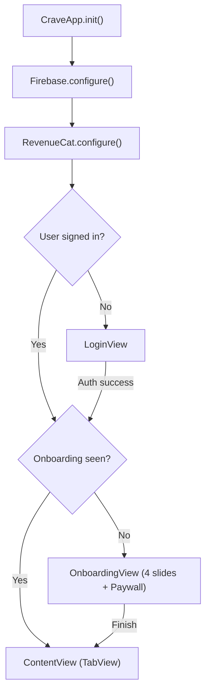

# Architecture

## App Lifecycle



## Tab Structure

```
ContentView (TabView)
├── Tab 1: HomeView         — Greeting, Explore recipes
├── Tab 2: MyRecipesView    — User's saved recipes, import, create
├── Tab 3: PantryView       — Ingredient list, scan, manual add
├── Tab 4: GroceryView      — Shopping list
└── Tab 5: ProfileView      — Account, subscription, settings
```

## Service Layer (Singletons)

| Service | Responsibility |
|---------|---------------|
| `AuthService.shared` | Firebase Auth state, sign in/out, profile updates |
| `RecipeService.shared` | Recipe CRUD, backend communication, Firestore listeners |
| `DataService.shared` | Pantry + Grocery CRUD via Firestore |
| `SubscriptionManager.shared` | RevenueCat state, usage tracking, paywall logic |
| `GeminiService` | On-device AI for ingredient scanning from photos |

## Design Patterns

### MVVM (Model-View-ViewModel)

Views are kept thin and focused on presentation. Business logic lives in ViewModels and Services.

**Example: Pantry Management**

```
PantryView (SwiftUI)
    ↓
PantryViewModel (@Published state)
    ↓
DataService (Firestore operations)
```

### Singleton Services

Core services are singletons accessed via `.shared`. This ensures:
- Single source of truth for app-wide state
- Easy dependency injection
- Consistent API surface

### Real-time Listeners

Firestore listeners keep the UI in sync with backend changes:
- User adds item on iPad → iPhone updates instantly
- No manual refresh required
- Optimistic UI updates with rollback on failure

## Project Structure

```
Crave/Crave/
├── CraveApp.swift           # App entry point
├── ContentView.swift        # Main TabView
├── Secrets.swift            # API keys and backend URL
├── Info.plist
├── GoogleService-Info.plist
│
├── DesignSystem/
│   ├── Colors.swift         # Color palette
│   └── Typography.swift     # Custom fonts
│
├── Models/
│   ├── Recipe.swift
│   ├── Ingredient.swift
│   ├── PantryItem.swift
│   └── GroceryItem.swift
│
├── Services/
│   ├── AuthService.swift
│   ├── DataService.swift
│   ├── RecipeService.swift
│   ├── GeminiService.swift
│   ├── StorageService.swift
│   ├── VisionService.swift
│   └── NetworkMonitor.swift
│
├── Managers/
│   └── SubscriptionManager.swift
│
├── ViewModels/
│   ├── PantryViewModel.swift
│   └── GroceryViewModel.swift
│
└── Views/
    ├── LoginView.swift
    ├── SignUpView.swift
    ├── OnboardingView.swift
    ├── ProfileView.swift
    ├── AISearchView.swift
    ├── Recipes/
    ├── Pantry/
    ├── Scanner/
    ├── Grocery/
    ├── Paywall/
    └── Components/
```

## Backend Architecture

```
backend/
├── main.py                  # FastAPI app
├── requirements.txt
├── Dockerfile
├── start.sh
├── .env
└── core/
    ├── config.py
    ├── youtube_service.py
    └── gemini_service.py
```

The backend is stateless and deployed to Cloud Run, scaling automatically based on demand.
