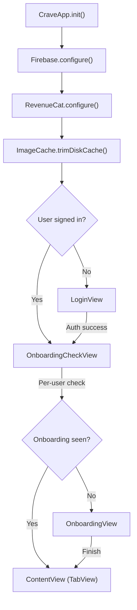

# Architecture

## App Lifecycle



## Tab Structure

```
ContentView (TabView)
├── Tab 1: HomeView         — Greeting, stats, explore feed with tag filtering
├── Tab 2: MyRecipesView    — User's saved recipes, import, create, generate
├── Tab 3: PantryView       — Ingredient list, scan, manual add
├── Tab 4: GroceryView      — Shopping list (badge shows active count)
└── Tab 5: ProfileView      — Account, subscription, allergens, developer mode
```

## Service Layer

| Service                      | Responsibility                                                   |
| ---------------------------- | ---------------------------------------------------------------- |
| `AuthService.shared`         | Firebase Auth state, sign in/out, profile updates                |
| `RecipeService.shared`       | Recipe CRUD, backend import, explore feed, post/remove from feed |
| `DataService.shared`         | Pantry + Grocery CRUD via Firestore                              |
| `SubscriptionManager.shared` | RevenueCat state, usage tracking, paywall logic                  |
| `GeminiService`              | Dual-model AI: vision (2.5 Pro) + text (2.0 Flash)               |
| `StorageService.shared`      | Firebase Storage image upload with resize/compression            |
| `NetworkMonitor.shared`      | NWPathMonitor connectivity tracking                              |
| `ImageCache.shared`          | Two-tier image cache (memory + disk)                             |
| `AllergenManager.shared`     | Allergen preference storage and ingredient detection             |
| `AIDebugLogger.shared`       | In-memory AI call logging for developer mode                     |

## Design Patterns

### MVVM

Views are thin. Business logic lives in ViewModels and Services.

**ViewModels:**

- `PantryViewModel` -- pantry items, filtering, sorting
- `GroceryViewModel` -- grocery list management
- `GenerateRecipeViewModel` -- AI recipe generation with auto-tagging
- `SpiceItUpViewModel` -- AI recipe modification plans

### Singleton Services

Core services accessed via `.shared`:

- Single source of truth for app-wide state
- Real-time listener management
- Auth-scoped listener setup/teardown

### Real-time Listeners

Firestore listeners keep the UI in sync. Client-side sorting avoids Firestore composite indexes. Explore feed filtered to exclude current user's recipes.

## Project Structure

```
Crave/Crave/
├── CraveApp.swift           # App entry, Firebase/RevenueCat init, deep links
├── ContentView.swift        # Main TabView
├── Config.swift             # Centralized constants (limits, keys, image settings)
├── HomeView.swift           # Home feed with stats + explore
│
├── DesignSystem/
│   ├── Colors.swift         # Color palette (Color.Crave.*)
│   ├── Typography.swift     # .craveFont() modifier
│   └── Components.swift     # Buttons, cards, FAB, toast, loading overlay
│
├── Models/
│   ├── Recipe.swift         # Recipe with backward-compatible Codable
│   ├── RecipeTag.swift      # 38 tags across 4 categories
│   ├── Ingredient.swift     # IngredientBase, Category, Unit
│   ├── PantryItem.swift     # PantryItem with StorageLocation
│   └── GroceryItem.swift    # GroceryItem with isChecked
│
├── Services/
│   ├── AuthService.swift
│   ├── DataService.swift
│   ├── RecipeService.swift
│   ├── GeminiService.swift      # Dual-model: vision + text
│   ├── VisionService.swift
│   ├── StorageService.swift
│   ├── NetworkMonitor.swift
│   └── AIDebugLogger.swift
│
├── Managers/
│   ├── SubscriptionManager.swift
│   ├── AllergenManager.swift    # 16 allergens with keyword detection
│   ├── HapticManager.swift
│   └── ImageCache.swift         # NSCache + FileManager two-tier cache
│
├── ViewModels/
│   ├── PantryViewModel.swift
│   ├── GroceryViewModel.swift
│   ├── GenerateRecipeViewModel.swift
│   └── SpiceItUpViewModel.swift
│
└── Views/
    ├── LoginView.swift
    ├── SignUpView.swift
    ├── OnboardingView.swift
    ├── ProfileView.swift
    ├── AISearchView.swift           # Chef Gemini kitchen assistant
    ├── Recipes/
    │   ├── MyRecipesView.swift
    │   ├── RecipeImportView.swift
    │   ├── RecipeDetailView.swift
    │   ├── CreateRecipeView.swift
    │   ├── GenerateRecipeView.swift # AI recipe generation
    │   ├── SpiceItUpView.swift      # AI recipe modification
    │   └── SearchRecipesView.swift
    ├── Pantry/
    ├── Scanner/
    ├── Grocery/
    ├── Paywall/
    └── Components/
```

### Share Extension

```
CraveShare/
├── ShareViewController.swift    # UIKit host + HeadlessImportView
└── Info.plist
```

The Share Extension allows importing recipes from Safari or any app's share sheet. Reuses `RecipeService.shared` and saves directly to Firestore.

## Backend Architecture

```
backend/
├── main.py                  # FastAPI app (extract, cancel-subscription, health)
├── requirements.txt
├── Dockerfile               # Python 3.11-slim + FFmpeg + Deno
└── core/
    ├── config.py            # Settings loader (dotenv)
    ├── youtube_service.py   # yt-dlp audio download with cookies support
    └── gemini_service.py    # Gemini 2.0 Flash for recipe extraction
```

The backend is stateless and deployed to Cloud Run, scaling automatically based on demand.
