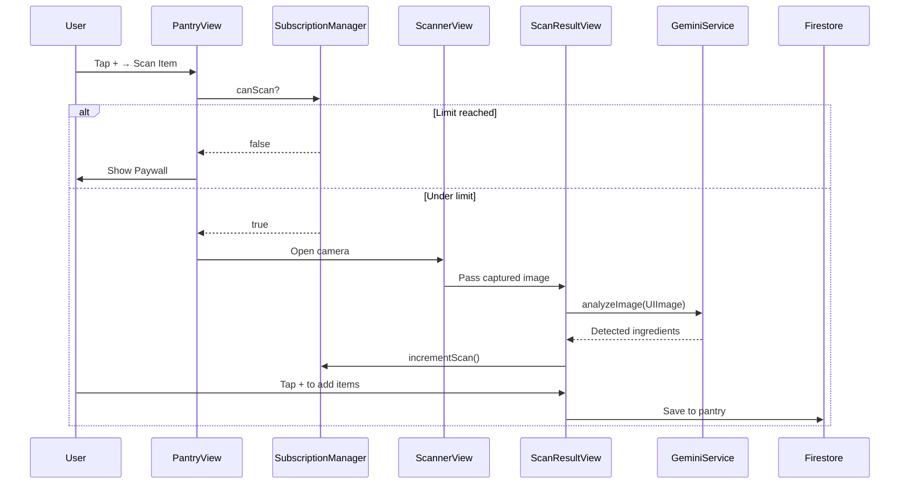

# Data Flow

## Recipe Import Flow

The user pastes a URL into `RecipeImportView` and taps Import. Before anything hits the network, `SubscriptionManager` checks whether the user has remaining imports. If the limit is reached, the RevenueCat paywall is shown and the flow stops there.

If the user has imports available, the URL is sent to the backend via `POST /extract`. The backend inspects the URL to determine whether it points to a video (YouTube, TikTok, Instagram Reels) or a standard website. For video URLs, yt-dlp downloads the audio track and forwards it to Google Gemini. For website URLs, the backend fetches the raw HTML and sends that to Gemini instead. Either way, Gemini returns a structured recipe JSON object with title, ingredients, steps, and timing.

The structured data comes back to the client, the import counter is incremented in `@AppStorage`, and the user sees a preview card. If they confirm, the recipe is saved to Firestore at `users/{uid}/recipes`.

## Ingredient Scan Flow



### Step-by-Step Breakdown

1. **User Action**: User taps "Scan Item" in pantry
2. **Permission Check**: `SubscriptionManager` verifies scan limit
3. **Paywall Gate**: If limit reached, show paywall
4. **Camera Launch**: Open `ScannerView` with camera permission
5. **Image Capture**: User takes photo of ingredients
6. **AI Analysis**: On-device Gemini Vision analyzes the image
7. **Results Display**: Show detected ingredients in `ScanResultView`
8. **Usage Tracking**: Increment scan counter
9. **Manual Refinement**: User can edit detected items
10. **Save**: Add confirmed items to Firestore pantry collection

## Authentication Flow

```
User taps "Sign In with Google"
    ↓
GoogleSignIn SDK presents OAuth flow
    ↓
User authorizes in Google's UI
    ↓
App receives Google ID token
    ↓
Exchange token with Firebase Auth
    ↓
Firebase returns user credential
    ↓
AuthService updates @Published user state
    ↓
App navigates to ContentView
```

## Real-time Sync

Firestore listeners maintain live connections:

```
App Launch
    ↓
Service layer attaches listeners
    ↓
Firestore pushes updates via WebSocket
    ↓
@Published properties update
    ↓
SwiftUI views re-render automatically
```

**Collections with active listeners:**
- `users/{uid}/recipes`
- `users/{uid}/pantry`
- `users/{uid}/grocery`
- `public/recipes` (for Explore feed)
