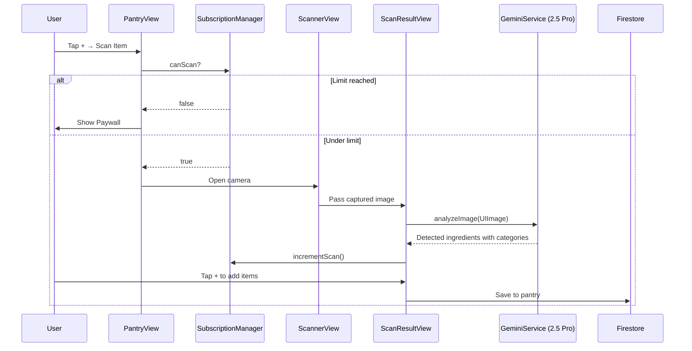

# Data Flow

## Recipe Import Flow

The user pastes a URL into `RecipeImportView` (or shares via the CraveShare extension). `SubscriptionManager` checks whether the user has remaining imports. If the limit is reached, the paywall is shown.

If imports are available, the URL is sent to the backend via `POST /extract`. The backend determines whether the URL is a video (YouTube, TikTok, Instagram) or a website. For video URLs, yt-dlp downloads the audio track and forwards it to Gemini 2.0 Flash. For websites, the HTML is fetched and sent to Gemini. Either way, a structured recipe JSON is returned.

The client receives the response via `RecipeService.importFromBackend()`, which uses a flexible decoder that handles multiple JSON key formats. The import counter is incremented and the recipe is saved to `users/{uid}/recipes`.

## AI Recipe Generation Flow

1. User opens `GenerateRecipeView` and picks a cuisine category
2. `GenerateRecipeViewModel` builds a prompt (including allergen restrictions if set)
3. Gemini 2.0 Flash returns a structured recipe JSON
4. Recipe is parsed, then auto-tagged via a second Gemini call
5. Time-based tags (Quick, Under 1hr) are inferred from prep+cook time
6. Recipe is saved to Firestore

## Ingredient Scan Flow



The image is resized to max 1536px and compressed to JPEG (0.8 quality) before being sent to Gemini 2.5 Pro. Up to 50 items per scan. Retry logic with exponential backoff handles rate limits.

## Authentication Flow

```
User taps "Sign In with Google" (or Email/Password)
    ↓
GoogleSignIn SDK presents OAuth (or Firebase email auth)
    ↓
Exchange with Firebase Auth
    ↓
AuthService.user @Published updates
    ↓
OnboardingCheckView (per-user AppStorage key)
    ↓
ContentView or OnboardingView
```

## Explore Feed Flow

```
RecipeService.startExploreListening()
    ↓
Firestore: recipes where isPublic == true (limit 50)
    ↓
Client-side filter: exclude current user's recipes
    ↓
Client-side sort: by createdAt descending
    ↓
HomeView with tag-based filtering
```

Users can:
- **Post to feed**: copies recipe to global `recipes` collection
- **Remove from feed**: deletes from global collection
- **Save from explore**: creates a private copy with new UUID

## Real-time Sync

Firestore listeners maintain live connections:

**Collections with active listeners:**
- `users/{uid}/recipes`
- `users/{uid}/pantry`
- `users/{uid}/grocery`
- `recipes` where `isPublic == true` (Explore feed)
